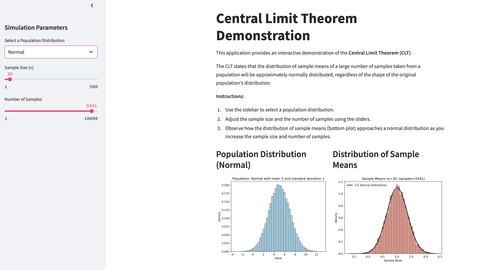

# Central Limit Theorem (CLT) Interactive Demo

An interactive web application that visually demonstrates the Central Limit Theorem using Streamlit. Users can explore how sample means from different population distributions converge to a normal distribution as sample size increases.

## Key Features

- **Interactive controls** for:
  - Population distribution selection (Uniform, Normal, Exponential)
  - Adjustable sample size (1-500)
  - Adjustable number of samples (1-10000)
- **Visualizations**:
  - Population distribution histogram
  - Sampling distribution of sample means
  - Theoretical normal curve predicted by CLT
- **Real-time parameter display**:
  - Population mean (μ)
  - Theoretical standard error (σ/√n)

## Requirements
- Python 3.7+
- streamlit
- numpy
- matplotlib
- scipy

## Understanding CLT
The Central Limit Theorem states that when independent random variables are averaged, their properly normalized sum tends toward a normal distribution, regardless of the original population's distribution. This demo helps visualize:
- Convergence to normality as sample size increases
- Decreasing standard error with larger sample sizes
- Independence of CLT from population distribution shape

